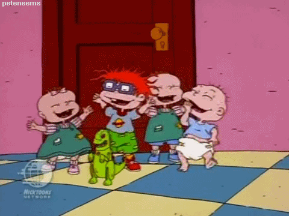
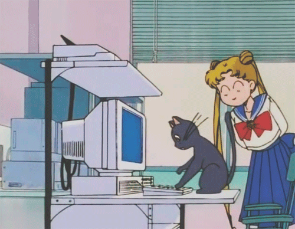

# GifTastic!

A dynamic web page that populates with cartoon character gifs.

## Built With

* HTML
* CSS/Bootstrap
* JavaScript
* jQuery
* Ajax
* GIPHY API

## Getting Started

1. Click on a button to use the app.

2. When the button is clicked, the page will grab 10 static non-animated gif images and place them on the page.

3. Click on the images to animate them. Click on them again to make them stop playing. 

4. Ratings are displayed under every gif (PG, G, so on).

5. Create a button by typing in a cartoon in the Search Box and click "GifTastic!" to add the button to the page. Click the button to display the gif.

